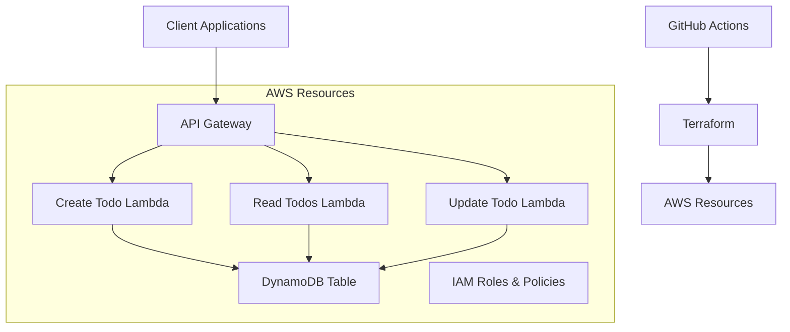
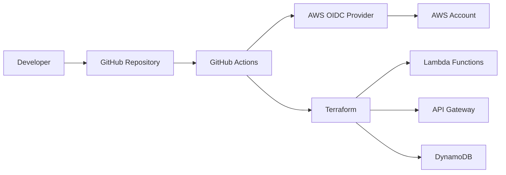

# Design Document

## Overview

This design outlines a serverless todo API built with AWS Lambda, DynamoDB, and API Gateway, deployed using Terraform and GitHub Actions. The architecture follows AWS Well-Architected principles with a focus on cost optimization, security, and maintainability. The system uses TypeScript for type safety and AWS SDK v3 for optimal performance and smaller bundle sizes.

## Architecture

### High-Level Architecture



### Deployment Architecture



## Components and Interfaces

### API Gateway Configuration

- **REST API** with three resources:
  - `POST /todos` - Create new todo
  - `GET /todos` - Retrieve all todos
  - `PUT /todos/{id}/complete` - Mark todo as complete
- **CORS Configuration** for cross-origin requests
- **Request/Response Transformations** for consistent API responses
- **Throttling and Rate Limiting** to prevent abuse

### Lambda Functions

#### 1. Create Todo Function (`create-todo`)
- **Runtime**: Node.js 18.x
- **Memory**: 256 MB
- **Timeout**: 10 seconds
- **Handler**: `src/handlers/create-todo.handler`
- **Environment Variables**: 
  - `TODOS_TABLE_NAME`
  - `AWS_REGION`

#### 2. Read Todos Function (`read-todos`)
- **Runtime**: Node.js 18.x
- **Memory**: 256 MB
- **Timeout**: 10 seconds
- **Handler**: `src/handlers/read-todos.handler`
- **Environment Variables**: 
  - `TODOS_TABLE_NAME`
  - `AWS_REGION`

#### 3. Update Todo Function (`update-todo`)
- **Runtime**: Node.js 18.x
- **Memory**: 256 MB
- **Timeout**: 10 seconds
- **Handler**: `src/handlers/update-todo.handler`
- **Environment Variables**: 
  - `TODOS_TABLE_NAME`
  - `AWS_REGION`

### DynamoDB Table Design

#### Table: `todos`
- **Partition Key**: `id` (String) - UUID v4
- **Attributes**:
  - `id`: String (Primary Key)
  - `title`: String (Required)
  - `status`: String (pending | completed)
  - `createdAt`: String (ISO 8601 timestamp)
  - `updatedAt`: String (ISO 8601 timestamp)
- **Billing Mode**: On-Demand (cost-effective for variable workloads)
- **Point-in-time Recovery**: Enabled
- **Encryption**: AWS managed keys

### Project Structure

```
├── .github/
│   └── workflows/
│       └── deploy.yml
├── src/
│   ├── handlers/
│   │   ├── create-todo.ts
│   │   ├── read-todos.ts
│   │   └── update-todo.ts
│   ├── lib/
│   │   ├── dynamodb.ts
│   │   ├── responses.ts
│   │   └── types.ts
│   └── utils/
│       └── validation.ts
├── terraform/
│   ├── main.tf
│   ├── variables.tf
│   ├── outputs.tf
│   ├── api-gateway.tf
│   ├── lambda.tf
│   ├── dynamodb.tf
│   └── iam.tf
├── package.json
├── tsconfig.json
├── webpack.config.js
└── README.md
```

## Data Models

### Todo Interface
```typescript
interface Todo {
  id: string;
  title: string;
  status: 'pending' | 'completed';
  createdAt: string;
  updatedAt: string;
}
```

### API Request/Response Models

#### Create Todo Request
```typescript
interface CreateTodoRequest {
  title: string;
}
```

#### API Response Wrapper
```typescript
interface ApiResponse<T> {
  statusCode: number;
  body: string; // JSON stringified
  headers: {
    'Content-Type': 'application/json';
    'Access-Control-Allow-Origin': '*';
  };
}
```

## Error Handling

### Error Response Format
```typescript
interface ErrorResponse {
  error: {
    message: string;
    code: string;
    details?: any;
  };
}
```

### Error Categories
1. **Validation Errors** (400): Invalid request format or missing required fields
2. **Not Found Errors** (404): Todo item not found
3. **Server Errors** (500): DynamoDB errors, Lambda timeouts, or other system failures

### Error Handling Strategy
- **Lambda Level**: Try-catch blocks with structured error responses
- **API Gateway Level**: Error response templates for consistent formatting
- **DynamoDB Level**: Retry logic with exponential backoff for transient failures

## Testing Strategy

### Unit Testing
- **Framework**: Jest with TypeScript support
- **Coverage**: All handler functions and utility modules
- **Mocking**: AWS SDK calls using `aws-sdk-client-mock`
- **Test Files**: `src/**/*.test.ts`

### Integration Testing
- **Local Testing**: Use LocalStack for local AWS service emulation
- **End-to-End**: Test complete API workflows
- **Database Testing**: Test DynamoDB operations with test tables

### Testing Commands
```bash
npm test              # Run unit tests
npm run test:watch    # Watch mode for development
npm run test:coverage # Generate coverage report
```

## Security Considerations

### IAM Roles and Policies
- **Principle of Least Privilege**: Each Lambda function has minimal required permissions
- **Resource-Specific Policies**: DynamoDB access limited to specific table
- **No Hardcoded Credentials**: All authentication via IAM roles

### API Security
- **CORS Configuration**: Controlled cross-origin access
- **Input Validation**: Strict validation of all API inputs
- **Rate Limiting**: API Gateway throttling to prevent abuse

### GitHub Actions Security
- **OIDC Authentication**: No long-lived credentials stored in GitHub
- **Environment Protection**: Production deployments require approval
- **Secret Management**: Sensitive values stored in GitHub Secrets

## Deployment Configuration

### Terraform Configuration
- **State Management**: Remote state in S3 with DynamoDB locking
- **Environment Separation**: Separate workspaces for dev/staging/prod
- **Resource Tagging**: Consistent tagging strategy for all resources

### GitHub Actions Workflow
- **Trigger**: Push to main branch and pull requests
- **Steps**:
  1. Checkout code
  2. Setup Node.js and dependencies
  3. Run tests and linting
  4. Build TypeScript
  5. Package Lambda functions
  6. Configure AWS credentials via OIDC
  7. Run Terraform plan
  8. Apply Terraform changes (main branch only)

### Resource Tags
All AWS resources will include these tags:
- `Application`: "serverless-todo-api"
- `Environment`: "production" | "staging" | "development"
- `ManagedBy`: "terraform"
- `Repository`: GitHub repository URL
- `Owner`: Team or individual responsible

## Performance Considerations

### Lambda Optimization
- **Cold Start Mitigation**: Minimal dependencies, efficient initialization
- **Memory Allocation**: Right-sized based on actual usage patterns
- **Concurrent Execution**: Appropriate reserved concurrency settings

### DynamoDB Optimization
- **On-Demand Billing**: Cost-effective for variable workloads
- **Query Patterns**: Optimized for single-item operations
- **Connection Reuse**: Persistent DynamoDB client across invocations

### Bundle Optimization
- **Webpack Configuration**: Tree-shaking and minification
- **External Dependencies**: AWS SDK v3 marked as external
- **Code Splitting**: Separate bundles for each Lambda function